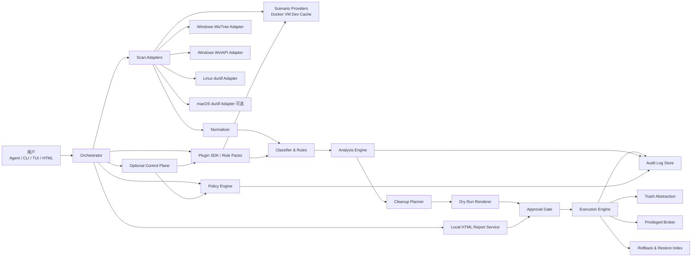
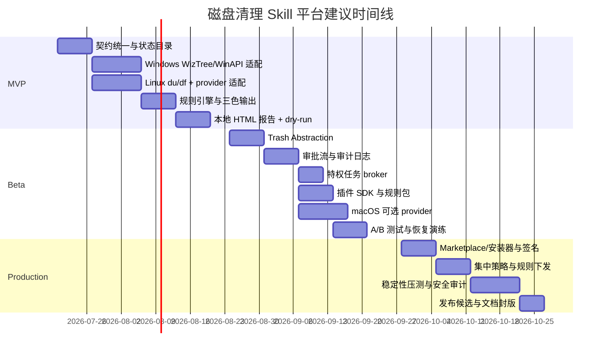

# 跨平台磁盘清理 Skill 平台深度研究与设计报告

## Executive Summary

现有“磁盘清理”相关 Skill 与相近仓库，已经形成了几条很清晰的路线：一条是 **只读扫描 + 三色分级 + HTML 报告**，代表是 `KKKKhazix/khazix-skills` 的 `storage-analyzer` 及其 Windows 适配 fork；一条是 **脚本化清理 + per-task dry-run/确认**，代表是 `haotianteng/FreeSpace`；一条是 **本地服务/仪表盘 + 审批后执行 + 审计日志**，代表是 `jcordon5/disk-cleaner-skill`；还有一条是 **面向 macOS 或开发者场景的深度清理/卸载/残留清扫**，代表是 `macsweep`、`Mole`、`devsweep` 等。官方与生态文档也已证明，Agent Skills/Plugins 本身就是“指令 + 脚本 +资源”的组合包，天然适合把“扫描、分析、计划、审批、执行、审计”拆成可组合模块。citeturn6view2turn6view3turn11view0turn9view3turn19view1turn29view0turn28view0turn28view1

但现有项目的共同短板也很明显：平台覆盖不完整；安全边界不一致；回收站/回退语义不统一；规则库往往写死在脚本里；有的仓库强调“只读”，有的仓库却又附带本地删除接口；有的项目会自动下载外部程序；还有一些项目范围过宽，纳入监控、调度、重复文件、系统优化后，成熟度和可验证性跟不上功能承诺。更重要的是，Skills 生态本身已经被研究证明存在显著安全面：2026 年的两篇实证研究分别发现，真实 Skills 生态中约 **26.1%** 的技能含至少一种漏洞，且带脚本的技能比纯说明型技能更容易出问题；另一项针对 skill 文件注入的基准也表明，第三方 skill 文件是可操作的 prompt injection 入口。因此，磁盘清理平台不能只看“能不能删”，而必须围绕 **能力最小化、审批链、回退链、供应链校验、审计可追溯** 来设计。citeturn16search1turn16search19turn16search12turn16search0turn16search4turn15search5

基于这些仓库与官方文档，我的结论非常明确：**不要继续做一个“单体脚本 Skill”**，而应设计成一个 **跨平台磁盘清理 Skill 平台**。推荐架构是：本地 agent 为主，内部拆为 **扫描适配层、标准化模型层、规则/分类层、计划层、审批层、执行层、审计层、UI 层、插件扩展层**；部署上默认是 **本地 agent + 本地 HTML 服务**，可选接一个 **集中策略/规则服务**；前端形态上以 **HTML 报告** 为主，辅以 **CLI**，把 **TUI** 作为服务器/SSH 环境增强选项。这样既能兼容当前 Skill 生态，又能把高风险能力收敛到少数受控模块中。citeturn28view2turn28view3turn28view4turn9view3turn13view0turn23search20

在扫描方法上，建议采用混合策略：**Windows 整盘优先 WizTree，文件夹/非 NTFS 回退 WinAPI；Linux 优先 du/df + 受控遍历；macOS 作为可选平台，优先 du/df 与系统 Trash API**。原因很简单：WizTree 官方就强调其对 NTFS 的 MFT 直读速度优势，并提供稳定的 CSV 命令行导出；GNU `du`/`df` 则天然适合 Linux/macOS 的只读体量估算与文件系统概览；Windows 官方 API 适合做权限可控的目录遍历、卷信息与执行层封装。citeturn17search2turn21search5turn26view0turn26view1turn27search0turn27search7

最终建议的产品策略是：**先做 Windows + Linux 的“扫描—分析—计划—dry-run—回收站执行—审计”闭环 MVP；再补 macOS 适配、插件 SDK、集中管理与 A/B 实验框架；最后再考虑重复文件、历史快照、自动调度与企业策略**。这一顺序既贴合你给定的默认平台范围，也最符合现有仓库里已经被验证过的成熟能力边界。citeturn6view0turn11view0turn9view3turn19view1turn19view3

## 现有项目谱系与结论

先说明一个检索边界：你点名的 `StorageAnalyzerWindows`，在公开可核验来源里我没有找到同名且可直接访问的独立仓库；但我找到了一个非常接近的 Windows 适配 fork：`JayHome137/Storage-Analyzer`，它明确声明基于 `KKKKhazix/khazix-skills` 中的同名 `storage-analyzer` 修改而来，并补充了 Codex/Windows 打包与验证逻辑。因此，下表将它作为“StorageAnalyzerWindows 类项目代表”纳入比较。citeturn6view3

| 项目 | 当前定位 | 主要优点 | 可复用模块 | 主要风险/不足 | 结论 |
|---|---|---|---|---|---|
| `KKKKhazix/khazix-skills/storage-analyzer` | 面向 macOS/Windows 的只读存储分析 Skill，输出三色分级 HTML 报告。citeturn6view2 | 把“扫描”和“删除”明确分离；三色分级对用户理解非常友好；HTML 报告是生态里最实用的交互形态之一。citeturn6view2 | 三色风险模型、报告模板、系统路径启发式、交互文案。citeturn6view2 | 原始设计强调“全程只读、删除命令只展示不执行”，对真正闭环清理支持有限；此前也出现过 Windows 兼容问题讨论。citeturn6view2turn2search9 | **非常适合作为“分析层/报告层”母体，不适合直接做最终执行器。** |
| `JayHome137/Storage-Analyzer` | 基于 khazix 的适配版，声明支持 macOS/Windows，附带交互式服务与受控删除。citeturn6view3turn13view0 | 在原有只读分析上补了 localhost 服务、session token、Host 校验、白名单删除。citeturn13view0 | 本地受控删除服务、127.0.0.1 绑定、allowlist 模型、open/trash/rm 多权限级别。citeturn13view0 | 存在“分析只读”与“服务可删”双语义；macOS Trash 失败时会 fallback 到 `~/.Trash` 搬运，且接口保留了 `rm` 直删模式；Windows 侧仍用 `SHFileOperationW`，而微软文档明确指出它已被 `IFileOperation` 取代。citeturn13view0turn17search3turn17search4 | **可借鉴执行网关设计，但必须收紧为“回收站优先、失败不自动硬删”。** |
| `WhiteMinds/disk-space-analyzer-skill` | Windows+macOS 分析型 Skill；Windows 明确依赖 WizTree，输出 JSON/命令分析。citeturn6view0turn14view0 | Windows 路线清晰：找 WizTree → 导出 CSV → JSON 分析；功能点覆盖 temp/cache/log/dev artifact；对迁移缓存目录有提示。citeturn6view0turn14view0 | Windows 扫描适配层、CSV 分析管线、平台分流文档。citeturn14view0turn14view1 | `find_wiztree.py` 支持自动下载便携版到 `~/.wiztree/`，这对用户体验好，但对供应链与哈希校验提出更高要求；Linux 没有纳入一等公民。citeturn9view1turn14view0 | **最适合作为 Windows 扫描适配器蓝本，但自动下载必须改为受控安装器。** |
| `haotianteng/FreeSpace` | Linux 发行版脚本式清理 Skill，按任务 dry-run/确认。citeturn11view0turn12view0turn12view1 | “每个任务先描述再执行”非常成熟；覆盖 pip/npm/Trash/Docker/apt/journal/oldlogs/CUDA/crash 等；明确区分用户级与 sudo 级任务。citeturn11view0turn12view0 | Linux provider、per-task dry-run、CUDA keep-list、权限边界。citeturn11view0turn12view0 | 直接使用 `rm -rf` 清理多个目标，虽然有 dry-run/确认，但没有统一回收站抽象，日志与回退链不足。citeturn12view0 | **很适合作为 Linux 平台 provider，不适合作为通用执行内核。** |
| `jcordon5/disk-cleaner-skill` | macOS/Linux 的安全优先清理器：扫描、计划、审批、dashboard、审计。citeturn9view3turn22view0 | 有独立的 `scan / plan / serve / clean / report` 状态机；默认本地状态目录；append-only 审计日志；清理前再独立复核一次分类；区分 `safe / safe_redownload / review / protected` 四档。citeturn9view3turn9view4turn22view0 | 统一状态目录、四级风控、审批式计划、append-only 审计。citeturn22view0turn9view3 | Windows 缺位；目录/规则更多偏 Unix 用户空间。citeturn9view3turn22view0 | **这是最值得借鉴的“平台骨架”。** |
| `leoncuhk/macsweep` | macOS 全家桶维护 Skill：卸载、启动项、清理、健康检查。citeturn19view1turn6view5 | 覆盖 30+ 残留位置、40+ 缓存类型、BTM/LaunchAgents 等 macOS 特性；强调 Trash over rm、never delete list。citeturn19view1 | macOS 规则库、残留扫描、启动项与应用卸载知识库。citeturn19view1 | 平台专用性很强，不能直接抽成跨平台 core。citeturn19view1 | **适合作为 macOS 可选 provider 与规则包。** |
| `semo-labs/device-speed-doctor` | Windows/macOS 的“变慢诊断 + 可逆修复” Skill。citeturn29view0turn29view1 | 强调 evidence-driven fixes、WhatIf/dry-run、备份启动项变更、blocked actions、客户可交付 HTML 报告。citeturn29view0 | “清理不是目的，修复体验才是目的”的 technician workflow、备份位置与 blocked actions 呈现。citeturn29view0 | 关注点不止磁盘；未选择开源许可证，公开可见不等于可复用。citeturn29view0 | **值得借鉴报告与回退文案，不宜直接整合代码。** |
| `msmobileapps/vm-disk-cleanup-plugin` | 针对虚拟机/协作环境 ENOSPC 的专用插件。citeturn6view6turn19view0 | 场景聚焦，能补“VM/容器磁盘爆满”的企业痛点。citeturn6view6 | VM/ENOSPC 诊断 provider、专用恢复 playbook。citeturn6view6 | 不是通用桌面清理器，范围太窄。citeturn6view6 | **适合作为可插拔场景插件，而不是主平台主线。** |
| `gccszs/disk-cleaner` | 跨平台综合工具，声明覆盖监控、调度、重复文件、进阶扫描。citeturn19view3 | 视野很全，已考虑 sample/progressive scan、平台特定清理、调度。citeturn19view3 | 进度扫描、调度器、平台抽象思路。citeturn19view3 | 范围偏大；功能承诺远大于当前公开成熟度，容易引入复杂度债务。citeturn19view3 | **可以参考路线图，不建议直接作为基底。** |
| `tw93/Mole` | 更成熟的相邻 macOS CLI 工具，不是传统 Skill，但模型接近产品化。citeturn32view0 | 既有 `--dry-run`、历史日志、JSON 输出，又有 `mo analyze`、`mo clean`、`mo uninstall` 等成熟命令面；明确说明某些分析通过 Finder 移入 Trash 更安全。citeturn32view0 | TUI/CLI 交互、历史日志、JSON 输出、macOS 深度 provider。citeturn32view0 | 偏原生 Mac 工具；并非面向 Windows/Linux 统一 Skill 平台。citeturn32view0 | **可作为“成熟 UX 参考”，尤其适合 TUI/CLI 设计。** |

如果把上面这些项目压缩成一句话：**khazix 给了你“分级报告”，WhiteMinds 给了你“Windows 扫描通路”，FreeSpace 给了你“Linux 执行 provider”，jcordon 给了你“平台骨架与审计链”，macsweep/Mole 给了你“macOS 深水区规则”，device-speed-doctor 给了你“维修工式交付”，而安全论文告诉你“必须把 Skills 当成潜在攻击面，而不是无害脚本”。** citeturn6view2turn14view0turn11view0turn22view0turn19view1turn32view0turn29view0turn16search1turn16search0turn16search12

扫描方法上，我给出的选择矩阵如下：

| 扫描方法 | 最适场景 | 优势 | 限制与风险 | 建议 |
|---|---|---|---|---|
| WizTree CSV 导出 | Windows、NTFS、整盘扫描 | 直接读 NTFS MFT，速度极快；官方支持命令行 CSV 导出和过滤。citeturn21search5turn17search2 | 依赖外部程序；对供应链与安装器要求高；对非 NTFS 价值下降。citeturn17search2turn9view1 | **Windows 整盘首选**。 |
| GNU `du` | Linux/macOS、目录级扫描 | 标准工具、易部署，支持 `--max-depth`、`--threshold`、`--one-file-system`。citeturn26view0 | 本质是“估算”；在压缩、CoW、网络文件系统等情形下与底层实际占用可能偏差。citeturn26view0 | **Linux/macOS 默认首选**。 |
| GNU `df` | 所有 Unix-like 的卷级概览 | 适合先确定哪个挂载点最紧张。citeturn26view1 | 只能看文件系统视角，不能定位目录/文件。citeturn26view1 | **所有扫描前先跑一次**。 |
| WinAPI 遍历 + 卷信息 | Windows 文件夹扫描、非 NTFS、执行层 | `GetDiskFreeSpaceEx` 与 `FindFirstFileEx` 可做卷信息与目录遍历的官方实现。citeturn27search0turn27search7 | 大盘全量速度不如 MFT 路线；实现复杂度更高。citeturn27search7turn21search5 | **作为 Windows 回退方案**。 |
| WinDirStat/相邻 GUI 扫描器 | 人工交互诊断 | 官方定位就是 Windows 的 disk usage analyzer & cleanup assistant。citeturn21search11turn4search0 | 更偏人工 GUI，不适合 Skill 平台内核。citeturn21search11 | **仅作为外部参考/手工比对工具**。 |
| `dua-cli` 风格并行扫描 | 本地 SSD/NVMe、大文件树、TUI | 并行遍历，官方 README 直接写明会“max out your SSD”。citeturn33search0 | 对 HDD、网络盘、低 IOPS 场景可能带来明显抖动。citeturn33search0turn33search8 | **作为可选 TUI provider，不做默认值**。 |

## 推荐平台架构

我推荐的不是“再拼一个 Skill 目录”，而是一个 **Skill 外表、平台内核** 的结构。技能包只是分发形式；真正的系统应该有自己的统一数据模型、provider 接口、策略引擎与审计层。这样做，既符合 Agent Skills 的目录规范，也符合插件化发布、namespacing、版本升级与市场分发的官方路径。citeturn28view1turn28view2turn28view3turn28view4



这个架构有几个关键判断。

第一，**扫描层和执行层必须物理分离**。`khazix` 的价值正来自它对“只读扫描”的强调；`jcordon` 的价值则在于把执行放到单独的 `clean` 子命令里；而 `JayHome` 的经验说明，一旦你引入本地服务执行，就必须绑定 localhost、加 session token、做 Host 校验与路径白名单。平台设计上不应把这些安全假设藏在一个 bash/python 脚本里，而应把它们上升为强制架构约束。citeturn6view2turn22view0turn13view0

第二，**风险模型不要停留在三色，而应内部四档、外部三色**。现有生态里，三色最便于用户理解；但 `jcordon` 的四档模型更适合真正执行：`safe`、`safe_redownload`、`review`、`protected`。我建议最终产品对用户继续显示绿/黄/红，但内部执行语义分成四档：  
绿色 = 可直接处理的可再生缓存/日志/临时文件；  
黄色 = 可移动到回收站、但需要用户逐项或分组确认的“可恢复但可能有代价”的对象；  
红色 = 受保护对象、系统关键路径、云同步、凭据、真实用户数据，只能解释、不能自动执行。  
这样既保留了 `khazix` 的直觉性，又吸收了 `jcordon` 的可执行性。citeturn6view2turn22view0

第三，**本地 HTML 服务应是主交互面，CLI 是通用后备，TUI 是增强件**。原因不是“网页更漂亮”，而是现有项目已经证明：HTML 最适合呈现折叠树、空间占比、分类说明、推荐命令、二次确认与恢复提示；CLI 仍然是自动化/SSH/代理调用基础；而 Mole、dua-cli 这类工具说明，TUI 在高频专业用户里有明显价值，但不该成为首发默认面。citeturn6view2turn9view3turn32view0turn33search0

第四，**Rule Pack 必须独立于代码**。现有仓库的一个普遍问题，是分类规则散落在 Python/PowerShell/bash 里，导致跨平台整合非常痛苦。平台应把“路径模式、文件类型、命令建议、风险级别、可回滚语义、权限要求、OS 约束”全部外提成版本化规则包。这样你才能真正复用 `FreeSpace` 的 Linux 任务、`macsweep` 的 macOS 规则、`khazix` 的三色文案、`jcordon` 的保护路径，而不把平台核心写成一个巨大的 if/else。citeturn11view0turn19view1turn22view0

模块职责建议如下：

| 模块 | 责任 | 输入 | 输出 | 必须满足的边界 |
|---|---|---|---|---|
| Orchestrator | 协调全流程、管理状态机 | 用户意图、策略、provider 可用性 | scan/analyze/plan/execute 作业 | 不直接删文件 |
| Scan Adapters | OS 或场景相关扫描 | 路径、卷、深度、过滤器 | 原始扫描结果 | 只读、可中断、可限流 |
| Normalizer | 统一数据模型 | WizTree CSV、`du`、WinAPI 列表等 | 标准 `scan_result` | 不丢失来源元数据 |
| Classifier & Rules | 风险分类、命令建议、文案生成 | 标准扫描结果 + 规则包 | `analysis_result` | 规则可热更新、可审计 |
| Cleanup Planner | 生成审批单元 | `analysis_result` + 用户偏好 | `cleanup_plan` | 默认不包含 protected |
| Approval Gate | 分组确认、二次确认、dry-run | `cleanup_plan` | 已审批任务集 | 审批必须可追踪 |
| Execution Engine | 真正执行 trash / privileged task | 已审批任务集 | 执行结果、回退索引 | 不接受任意路径 |
| Trash Abstraction | 统一回收站/废纸篓 | 文件/目录 URL | 结果位置、恢复句柄 | 优先可恢复，不可恢复时返回失败 |
| Privileged Broker | 处理 sudo/Admin 级任务 | 已审批特权任务 | 提示命令或受控执行结果 | 默认不静默提权 |
| Audit Log Store | 记录扫描、计划、执行、恢复 | 事件流 | JSONL/SQLite 审计记录 | append-only 或可校验篡改 |
| UI Service | 本地 HTML 面板 | 报告数据、token、只读资源 | `report.html`、本地 API | 仅 localhost，带 token |
| Plugin SDK | 提供 provider/rule pack 扩展位 | 插件元数据、签名、兼容信息 | 可加载扩展 | 受版本与权限策略约束 |

## 接口与数据契约

接口设计上，我建议默认采用 **本地服务 + 文件状态目录** 双轨：一方面方便 agent、CLI、HTML 前端共用；另一方面也保留像 `jcordon` 那样把全部状态落在单个 `.disk-cleaner` 目录中的可移植性。现有项目已经证明，状态目录、静态 HTML、localhost 服务都是可行路线；而 Agent Skills/Plugins 官方规范也支持把脚本、资源、references 一起打包发布。citeturn9view3turn13view0turn28view1turn28view2

核心接口建议如下：

| 接口 | 方法 | 调用方 | 作用 | 幂等性 | 说明 |
|---|---|---|---|---|---|
| `/api/v1/scan` | POST | Agent / CLI / HTML | 发起扫描 | 否 | 支持 `dry_metadata_only`、`max_depth`、`time_budget_sec` |
| `/api/v1/scans/{id}` | GET | Agent / HTML | 取扫描状态/结果 | 是 | 支持流式进度 |
| `/api/v1/analyze` | POST | Orchestrator | 生成分析结果 | 是 | 输入固定 scan id + ruleset version |
| `/api/v1/plans` | POST | Agent / HTML | 生成清理计划 | 是 | 可传 `risk_budget`、`prefer_trash=true` |
| `/api/v1/plans/{id}/approve` | POST | 用户交互面 | 记录审批 | 否 | 支持 item/group/category 粒度 |
| `/api/v1/executions` | POST | Agent / HTML | 执行计划 | 否 | 默认 `dry_run=true` |
| `/api/v1/executions/{id}` | GET | Agent / HTML | 查询执行结果 | 是 | 返回 recovered bytes / skipped / errors |
| `/api/v1/restores` | POST | Agent / HTML | 从回收站恢复 | 否 | 仅对有 restore handle 的项可用 |
| `/api/v1/audit` | GET | Agent / 管理端 | 读取审计日志 | 是 | 支持按作业、路径、风险级别过滤 |
| `/report/{job_id}.html` | GET | 浏览器 | 静态/半静态报告 | 是 | 本地资源、无公网依赖 |

下面四份 JSON Schema 是我建议的平台基础契约。它们不是从某一个仓库照搬，而是综合了 `WhiteMinds` 的 JSON 输出取向、`jcordon` 的状态目录模型、`khazix/JayHome` 的报告与执行分离思想后，向平台化收敛的结果。citeturn14view0turn14view1turn22view0turn6view2turn13view0

```json
{
  "$id": "https://example.local/schema/scan-result.json",
  "$schema": "https://json-schema.org/draft/2020-12/schema",
  "title": "scan_result",
  "type": "object",
  "required": ["scan_id", "platform", "started_at", "finished_at", "sources", "roots", "entries", "summary"],
  "properties": {
    "scan_id": { "type": "string" },
    "platform": { "type": "string", "enum": ["windows", "linux", "macos"] },
    "started_at": { "type": "string", "format": "date-time" },
    "finished_at": { "type": "string", "format": "date-time" },
    "sources": {
      "type": "array",
      "items": {
        "type": "object",
        "required": ["kind", "version"],
        "properties": {
          "kind": { "type": "string", "enum": ["wiztree", "winapi", "du", "df", "provider"] },
          "version": { "type": "string" },
          "raw_artifact": { "type": "string" }
        }
      }
    },
    "roots": {
      "type": "array",
      "items": { "type": "string" }
    },
    "entries": {
      "type": "array",
      "items": {
        "type": "object",
        "required": ["path", "kind", "size_bytes", "device_id", "symlink", "scan_source"],
        "properties": {
          "path": { "type": "string" },
          "kind": { "type": "string", "enum": ["file", "dir"] },
          "size_bytes": { "type": "integer", "minimum": 0 },
          "apparent_size_bytes": { "type": "integer", "minimum": 0 },
          "device_id": { "type": "string" },
          "inode_or_file_id": { "type": "string" },
          "symlink": { "type": "boolean" },
          "scan_source": { "type": "string" },
          "mtime": { "type": "string", "format": "date-time" }
        }
      }
    },
    "summary": {
      "type": "object",
      "required": ["total_bytes", "free_bytes", "entry_count"],
      "properties": {
        "total_bytes": { "type": "integer" },
        "free_bytes": { "type": "integer" },
        "entry_count": { "type": "integer" }
      }
    }
  }
}
```

```json
{
  "$id": "https://example.local/schema/analysis-result.json",
  "$schema": "https://json-schema.org/draft/2020-12/schema",
  "title": "analysis_result",
  "type": "object",
  "required": ["analysis_id", "scan_id", "ruleset_version", "bands", "highlights"],
  "properties": {
    "analysis_id": { "type": "string" },
    "scan_id": { "type": "string" },
    "ruleset_version": { "type": "string" },
    "bands": {
      "type": "object",
      "required": ["green", "yellow", "red"],
      "properties": {
        "green": { "$ref": "#/$defs/itemList" },
        "yellow": { "$ref": "#/$defs/itemList" },
        "red": { "$ref": "#/$defs/itemList" }
      }
    },
    "highlights": {
      "type": "object",
      "properties": {
        "top_space_hogs": { "$ref": "#/$defs/itemList" },
        "quick_wins_bytes": { "type": "integer" },
        "confidence": { "type": "number", "minimum": 0, "maximum": 1 }
      }
    }
  },
  "$defs": {
    "itemList": {
      "type": "array",
      "items": {
        "type": "object",
        "required": ["id", "path", "category", "risk_level", "suggested_action"],
        "properties": {
          "id": { "type": "string" },
          "path": { "type": "string" },
          "category": { "type": "string" },
          "risk_level": { "type": "string", "enum": ["safe", "safe_redownload", "review", "protected"] },
          "user_band": { "type": "string", "enum": ["green", "yellow", "red"] },
          "suggested_action": { "type": "string", "enum": ["delete", "trash", "manual", "forbid"] },
          "estimated_reclaim_bytes": { "type": "integer" },
          "reason": { "type": "string" },
          "requires_privilege": { "type": "boolean" },
          "provider": { "type": "string" }
        }
      }
    }
  }
}
```

```json
{
  "$id": "https://example.local/schema/cleanup-plan.json",
  "$schema": "https://json-schema.org/draft/2020-12/schema",
  "title": "cleanup_plan",
  "type": "object",
  "required": ["plan_id", "analysis_id", "mode", "items"],
  "properties": {
    "plan_id": { "type": "string" },
    "analysis_id": { "type": "string" },
    "mode": { "type": "string", "enum": ["dry-run", "execute"] },
    "items": {
      "type": "array",
      "items": {
        "type": "object",
        "required": ["item_id", "path", "approved_action"],
        "properties": {
          "item_id": { "type": "string" },
          "path": { "type": "string" },
          "approved_action": { "type": "string", "enum": ["delete", "trash", "manual"] },
          "prechecks": {
            "type": "array",
            "items": {
              "type": "string",
              "enum": [
                "realpath-within-root",
                "not-symlink",
                "not-protected",
                "not-cloud-sync",
                "not-open-handle",
                "same-device",
                "size-still-matches"
              ]
            }
          },
          "backup_policy": { "type": "string", "enum": ["none", "manifest-only", "snapshot-manifest"] },
          "restore_handle": { "type": "string" }
        }
      }
    }
  }
}
```

```json
{
  "$id": "https://example.local/schema/audit-log.json",
  "$schema": "https://json-schema.org/draft/2020-12/schema",
  "title": "audit_log_event",
  "type": "object",
  "required": ["event_id", "ts", "actor", "operation", "result"],
  "properties": {
    "event_id": { "type": "string" },
    "ts": { "type": "string", "format": "date-time" },
    "actor": {
      "type": "object",
      "properties": {
        "kind": { "type": "string", "enum": ["user", "agent", "service"] },
        "id": { "type": "string" }
      }
    },
    "operation": {
      "type": "object",
      "required": ["type"],
      "properties": {
        "type": { "type": "string", "enum": ["scan", "analyze", "plan", "approve", "trash", "delete", "restore"] },
        "job_id": { "type": "string" },
        "path": { "type": "string" }
      }
    },
    "result": {
      "type": "object",
      "required": ["status"],
      "properties": {
        "status": { "type": "string", "enum": ["ok", "skipped", "denied", "failed"] },
        "bytes_affected": { "type": "integer" },
        "message": { "type": "string" }
      }
    },
    "hash_prev": { "type": "string" },
    "hash_self": { "type": "string" }
  }
}
```

为了让 HTML 报告真正易用，我建议界面遵循下列骨架。这个结构吸收了 `khazix/JayHome/jcordon/WhiteMinds` 的共同优点：顶部概览、快速释放、风险分区、命令/按钮双通道、执行前说明、执行后审计入口。citeturn6view2turn6view3turn9view3turn6view0

```text
┌─────────────────────────────────────────────────────────────┐
│ 磁盘概览  卷使用率 | 可立即释放 | 需确认释放 | 受保护区说明      │
├─────────────────────────────────────────────────────────────┤
│ Top Space Hogs                                              │
│ 1. C:\Users\ExampleUser\AppData\Local\pip\Cache  12.4 GB   │
│ 2. ~/Downloads/old-installers                 8.9 GB       │
│ 3. ~/.cache/huggingface                      22.1 GB       │
├─────────────────────────────────────────────────────────────┤
│ 绿色  一键移回收站 / 直接清理（可全局关闭直接删除）         │
│ 黄色  默认仅移回收站，逐组确认                              │
│ 红色  解释原因 + 打开位置 + 给人工处置建议                  │
├─────────────────────────────────────────────────────────────┤
│ Dry-run diff | 审计日志 | 恢复入口 | 导出 JSON | 导出 HTML  │
└─────────────────────────────────────────────────────────────┘
```

## 安全、权限与供应链策略

这一部分必须比功能更严格。原因不是保守，而是 Skills 生态已经被证明是高风险输入面。研究显示，Skill 既可以通过指令层被注入，也可以通过脚本、下载地址、权限诱导、数据外传、命名伪装变成供应链载体；Anthropic 官方插件目录也明确警告，安装、更新、使用插件前必须信任来源，因为平台并不能验证其中的 MCP、脚本和其他软件是否会按预期工作或是否后续发生变化。换句话说，**磁盘清理 Skill 从设计上就该被当作“高破坏力扩展”，而不是普通工作流脚本”。** citeturn16search1turn16search12turn16search0turn28view4

我建议采用下面这组硬策略，并把它们做成默认不能关闭的“平台安全基线”。

| 场景 | 强制策略 | 设计理由 |
|---|---|---|
| 符号链接 | 扫描默认不跟随；执行前重新 `realpath` 校验，并要求目标仍在原始允许根内；对 link 本体与 target 分离建模。GNU `du` 已明确区分 `--dereference` 与 `--no-dereference` 语义。citeturn26view0 | 防止越界删除、软链接诱导与目录穿透。 |
| 回收站失败 | **禁止**“回收站失败后自动硬删”。Windows/macOS/Linux 都应把“无法移入回收站”视为失败，展示错误、记录审计，并让用户改走手工命令或特权流程。JayHome 的 macOS fallback 与 `rm` 通道说明这种边界必须被重新收紧。citeturn13view0turn20search7turn20search9turn18search7 | recoverability 比多释放几 GB 更重要。 |
| Windows 回收站 API | Win8+ 优先 `IFileOperation + FOFX_RECYCLEONDELETE`；仅在兼容层保留 `SHFileOperation` 回退。微软文档明确写明 `SHFileOperation` 已被 `IFileOperation` 取代。citeturn17search3turn17search4turn20search20 | 用新 API 统一可恢复删除语义与更可控的错误处理。 |
| macOS Trash | 优先 `FileManager.trashItem` 或 `NSWorkspace` 的 Trash 语义；两者都由 Apple 文档声明为“移动到废纸篓”，并可返回结果 URL。citeturn20search1turn20search7turn20search9 | 比自己搬运 `~/.Trash` 更可靠，且名称冲突时系统会给出真实落点。 |
| Linux Trash | 优先 `gio trash` 或遵循 FreeDesktop Trash 规范的实现；规范定义了 `$trash/files` 与原始路径/删除日期信息。`gio trash` 与 `trash-cli` 都支持 list/restore/empty。citeturn18search7turn1search5turn18search19turn18search4 | 回退与恢复链要统一，而不是到处 `rm -rf`。 |
| 白名单路径 | 执行层绝不接受任意路径；只能接受 plan 中经签名/哈希绑定过的 item id。JayHome 的 allowlist、localhost、token、Host 校验思路是对的，但要进一步收窄到“ID 驱动执行”。citeturn13view0 | 防止 HTML/Agent/脚本层注入任意文件删除。 |
| 用户确认流程 | 绿色支持批量确认，黄色必须二次确认并默认回收站，红色禁止自动执行。与 `khazix` 三色模型、`jcordon` 风险四档一致。citeturn6view2turn22view0 | 用户心智简单，但执行语义不含糊。 |
| 权限提升 | 默认不静默提权；像 FreeSpace、macsweep、device-speed-doctor 那样，优先把 sudo/Admin 命令显式呈现给用户，必要时由 privileged broker 受控执行。citeturn11view0turn19view1turn29view0 | 把提权变成显式事件，避免 Agent 越权。 |
| 供应链校验 | 禁止仓库代码在运行时无校验下载二进制；WhiteMinds 的 WizTree 自动下载体验虽好，但必须改造成“带 SHA-256/签名校验 + 官方源优先 + 用户确认”的安装器流程。citeturn9view1turn14view0 | 磁盘清理器本身不应成为投毒入口。 |
| Skill 注入风险 | Skill 包必须执行静态检查：SKILL.md frontmatter、allowed-tools、脚本 shebang、网络调用、下载器、提权参数、出站 URL、写权限宣告。Agent Skills 规范已支持 `allowed-tools` 字段，且 progressive disclosure 可减少不必要上下文暴露。citeturn28view1turn28view0turn16search0turn16search1 | 从“能运行”升级为“能审计、能限制、能解释”。 |

在权限策略上，我建议默认分成三层。

**普通用户层**：扫描、分析、计划、用户目录缓存清理、回收站移动、恢复、导出报告。这一层必须做到完全可用，因为这是 80% 的真实需求。`FreeSpace`、`jcordon`、`macsweep` 都已证明：仅用户权限就足以覆盖 pip/npm/trash/browser/user cache/logs 等大量高收益目标。citeturn11view0turn9view3turn19view1

**特权提示层**：诸如 Windows Update 缓存、系统日志、journal、APT/DNF 缓存、系统级容器卷、hiberfil/pagefile 调整等，平台只负责识别、估算、解释和渲染手工命令，不默认代执行。WhiteMinds 文档、FreeSpace 脚本、device-speed-doctor 的 WhatIf 策略都说明，这类目标更适合作为“管理员建议事项”，而不是默认自动删除对象。citeturn14view0turn11view0turn29view0

**受控特权执行层**：只有当你将来明确需要“企业托管版”时，才增加 privileged broker。它必须是单独进程、单独权限、单独审计域，并且只接受平台签发的计划项，而不是任意 shell 命令。否则，它会立刻变成 Skill 注入攻击的最佳跳板。citeturn16search1turn16search12turn28view4

对于供应链，我给出最务实的建议是：**平台核心不要在运行时自动装第三方可执行文件**。如果确实要接入 WizTree、BleachBit、`trash-cli`、`dua-cli` 等外部工具，应由安装器在安装阶段处理，并记录到本地清单中，包括来源、版本、哈希、签名、安装时间与用户确认事件。官方插件文档与 marketplace 机制已经支持版本化发布与更新；你完全没有必要把外部下载逻辑掺进清理逻辑本身。citeturn28view2turn28view3turn28view4turn17search2turn17search5turn18search4turn33search0

## 测试、迁移与里程碑

测试策略上，我不建议沿用“脚本跑通就算完成”的思路，而应从第一天就把它当成 **文件系统安全产品** 来测。BleachBit 的官方测试指南就要求覆盖普通用户、root/sudo、命令行等多种组合；`jcordon` 也明确提供了安全测试；`khazix` 的 Windows 问题讨论则提醒我们，平台差异不会自己消失。citeturn17search10turn6view1turn2search9

验收导向的测试矩阵建议如下：

| 测试层 | 重点 | 样例 | 验收标准 |
|---|---|---|---|
| 单元测试 | 路径规范化、risk classifier、白名单校验、plan 生成、恢复句柄生成 | `~/.ssh`、symlink、cloud-sync、Downloads、node_modules、HuggingFace cache | protected 永不进入 executable plan；规则回归用 goldens 固化 |
| 适配器测试 | WizTree CSV 解析、WinAPI 枚举、`du/df` 解析、provider 结果归一化 | 固定 CSV fixture、fake `du` 输出、异常权限目录 | 归一化后字段齐全、大小一致、来源可追踪 |
| 集成测试 | scan → analyze → plan → dry-run → execute → audit → restore | 用户缓存、下载目录、日志、特权任务 | dry-run 与 execute 的目标集严格一致，差别只在 effect |
| 误删防护测试 | 符号链接、硬链接、挂载边界、系统目录、云同步目录 | `~/Documents`、OneDrive/iCloud/Dropbox、挂载点穿越 | 任一高风险路径都必须被拒绝或降级到 manual |
| 回滚演练 | 回收站恢复、restore manifest、部分失败恢复 | 绿色 100 项批量清理后恢复 10 项 | 恢复成功率 ≥ 99%，失败项必须有原因与手工方案 |
| 误删恢复演练 | 故意制造黄色误判样本，验证不会直删 | `Downloads` 中安装器、游戏 Mod、模型 cache | 黄色项默认只进回收站；无直删 |
| 压力测试 | 100 万文件树、深目录、网络盘、SSD/HDD 差异 | 本地 NVMe、大量小文件、SMB/NFS | 有 time budget、可中断、UI 不冻结 |
| 安全测试 | token/localhost、path injection、重复审批、审计篡改 | Host 伪造、跨站表单、路径替换 | 未审批路径执行成功率 = 0；审计链可检测篡改 |
| A/B 测试 | HTML vs TUI、摘要说明 vs 原始目录树 | 两组用户完成释放 5GB 任务 | 看“完成率、放弃率、误删率、恢复请求率”四指标 |

我建议把**硬性验收标准**写死成下面几条：

1. **默认全路径 dry-run 可用**：任一执行流，用户都能先看到完全相同目标集的 dry-run。  
2. **红色项零自动执行**：protected/system/cloud-sync/credential 类项，自动执行成功次数必须恒为零。  
3. **黄色项零直接删除**：黄色项只能进入回收站，不允许平台直接硬删。  
4. **恢复链可验证**：所有走回收站或 snapshot-manifest 的项目，都必须生成可查询 restore handle。  
5. **审计链完整**：扫描、计划、审批、执行、恢复必须形成连续日志。  
6. **本地服务零公网依赖**：HTML 报告与本地 API 在断网环境同样可工作。  

迁移与整合步骤建议如下。这里不是“重写所有仓库”，而是有选择地把共性抽出来。

**第一阶段，先统一契约，不统一 UI。**  
把 `khazix/JayHome/WhiteMinds/jcordon/FreeSpace/macsweep` 的核心输出，都接到统一 `scan_result / analysis_result / cleanup_plan / audit_log` 模型上。你一旦完成这一步，后面替换任何 provider 都不会推倒重来。citeturn6view2turn6view3turn14view0turn22view0turn11view0turn19view1

**第二阶段，把规则从脚本里剥离成 Rule Pack。**  
最先迁入的规则建议是：  
Windows：temp/cache/log/node_modules/.vs/obj/Downloads/system-recommendations；  
Linux：pip/npm/trash/docker_builder/apt-or-dnf/journal/oldlogs/CUDA；  
macOS：Library/Caches、DerivedData、Xcode/device support、LaunchAgents 残留、已卸载应用残留。citeturn14view0turn11view0turn19view1

**第三阶段，执行层只做三件事：trash、restore、manual recipe。**  
不要一开始就做全功能 delete engine。先把 80% 最安全路径闭环。JayHome 的 localhost 执行网关、FreeSpace 的 per-task 描述、jcordon 的 re-validation 都能被吸收进这一步。citeturn13view0turn12view0turn22view0

**第四阶段，再接 UI、插件与控制面。**  
等执行层稳定后，再增加 HTML 报告美化、TUI、namespaced plugin 打包、集中规则下发。Claude Code 官方插件文档明确区分了 standalone 配置与 plugin 形态，适合先本地、后市场分发。citeturn28view2turn28view3

需要的工具/库/外部程序，我建议按“优先来源”与“角色”选择，不要贪多：

| 类别 | 建议首选 | 用途 | 优先来源 |
|---|---|---|---|
| Windows 高速扫描 | WizTree | NTFS 整盘高速扫描与 CSV 导出 | 官方站点/官方文档。citeturn17search2turn21search5 |
| Windows 卷信息与遍历 | `GetDiskFreeSpaceEx`、`FindFirstFileEx` | 卷统计、文件夹扫描、回退适配 | Microsoft Docs。citeturn27search0turn27search7 |
| Windows 回收站 | `IFileOperation` | 可恢复删除 | Microsoft Docs。citeturn17search4turn17search3 |
| Linux/macOS 容量概览 | `df` | 卷级使用率 | GNU Coreutils 官方文档。citeturn26view1 |
| Linux/macOS 目录体量 | `du` | 目录级估算、深度控制、单文件系统限制 | GNU Coreutils 官方文档。citeturn26view0 |
| Linux 回收站 | `gio trash` | 标准 Trash 语义 | GIO 手册 / FreeDesktop Trash 规范。citeturn1search5turn18search7 |
| 跨平台回收站 CLI | `trash-cli` | 平台兜底与脚本化 | 官方 GitHub README。citeturn18search4 |
| macOS Trash | `FileManager.trashItem` / `NSWorkspace` | 系统原生废纸篓 | Apple Developer。citeturn20search1turn20search7turn20search9 |
| 可选 cleaner provider | BleachBit + CleanerML | 规则扩展、preview 模式、Windows/Linux 清理 provider | 官方文档。citeturn17search0turn17search1turn17search11 |
| 可选 TUI 扫描 | `dua-cli` | 高性能本地交互遍历 | 官方 GitHub README。citeturn33search0 |
| 技能/插件分发 | Agent Skills spec + Claude Plugins | 打包、命名空间、版本更新、市场分发 | 官方规范/官方文档。citeturn28view1turn28view2turn28view3turn28view4 |

建议排期如下。下面这张甘特图默认项目启动时间为 **2026-07-20**，目标是在不预设大团队的情况下，优先做可用而不是做全。



配套里程碑表可以直接落成产品管理文档：

| 里程碑 | 时间窗 | 范围 | 退出标准 |
|---|---|---|---|
| MVP | 2026-07-20 ～ 2026-08-22 | Windows+Linux 扫描、分析、HTML 报告、dry-run、三色分级 | 能稳定找出空间大户；不执行任何高风险删除；报告可离线打开 |
| Beta | 2026-08-24 ～ 2026-09-26 | 回收站执行、恢复链、审计日志、插件 SDK、macOS 可选支持 | 绿色闭环可执行，黄色回收站可恢复，审计完整 |
| 生产 | 2026-09-28 ～ 2026-10-30 | 安装器、签名、规则分发、控制面、安全审计、文档 | 安装/更新/回滚稳定，供应链可校验，误删恢复演练通过 |

最后给两段关键代码示例。第一段是**安全写审计文件**：先写临时文件，再 `fsync + os.replace`，避免部分写入与中断导致日志损坏。

```python
from __future__ import annotations

import json
import os
import tempfile
from pathlib import Path
from typing import Any


def atomic_write_json(path: str | Path, payload: dict[str, Any]) -> None:
    """
    原子写入 JSON。
    适用于计划文件、状态文件、报告缓存。
    """
    target = Path(path)
    target.parent.mkdir(parents=True, exist_ok=True)

    with tempfile.NamedTemporaryFile(
        mode="w",
        encoding="utf-8",
        dir=str(target.parent),
        prefix=target.name + ".",
        suffix=".tmp",
        delete=False,
    ) as tmp:
        json.dump(payload, tmp, ensure_ascii=False, indent=2)
        tmp.flush()
        os.fsync(tmp.fileno())
        tmp_name = tmp.name

    os.replace(tmp_name, target)
```

第二段是**执行前路径复核**：不接受 UI 传来的任意路径，只接受 plan 封装过的项；并再次检查 `realpath`、符号链接、根边界与 protected 标记。这一层就是为了对抗误分类、界面注入与 TOCTOU 风险；它和 `jcordon` 的“clean 时独立再验证”、`JayHome` 的 allowlist 思路是一脉相承的，只是更适合作为平台内核。citeturn22view0turn13view0

```python
from __future__ import annotations

import os
from dataclasses import dataclass


@dataclass(frozen=True)
class PlannedItem:
    item_id: str
    original_path: str
    approved_action: str
    allowed_root: str
    protected: bool
    allow_symlink: bool = False


def validate_planned_item(item: PlannedItem) -> str:
    """
    返回最终可执行的 realpath；失败则抛出 ValueError。
    """
    if item.protected:
        raise ValueError(f"{item.item_id}: protected item cannot be executed")

    rp = os.path.realpath(os.path.expanduser(item.original_path))
    root = os.path.realpath(os.path.expanduser(item.allowed_root))

    if not (rp == root or rp.startswith(root + os.sep)):
        raise ValueError(f"{item.item_id}: path escaped allowed root")

    if os.path.islink(item.original_path) and not item.allow_symlink:
        raise ValueError(f"{item.item_id}: symlink targets are not executable by default")

    if not os.path.exists(rp):
        raise ValueError(f"{item.item_id}: target no longer exists")

    return rp
```

综合上面的项目比较、官方文档和安全研究，我的最终建议只有一句：**把它做成“本地优先、扫描只读、计划审批、回收站优先、规则外置、审计可追溯、插件可校验”的跨平台 Skill 平台，而不是继续堆一个更大的清理脚本。** 这样你既能复用现有生态里最成熟的部分，又能避开它们最容易翻车的部分。citeturn6view2turn14view0turn11view0turn22view0turn19view1turn28view4turn16search1turn16search12
